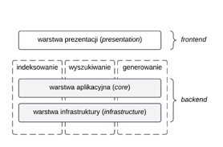

# Platforma analizy dokumentacji wewnętrznej

Platforma analizy dokumentacji wewnętrznej to system, który umożliwia pobieranie, przetwarzanie i przechowywanie aktów
prawnych i dokumentacji wewnętrznej, jak również analizę tych materiałów z wykorzystaniem dużych modeli językowych

Celem aplikacji jest wspieranie prawników oraz innych specjalistów wspierających procesy prawne organizacji w ocenie
zgodności prawnej dokumentacji wewnętrznej ze względu na zmiany w prawie powszechnie obowiązującym.

Podstawowy przypadek użycia obsługiwany przez aplikację to:

1. użytkownik wprowadza do systemu pliki PDF dokumentacji wewnętrznej,
2. użytkownik oznacza akty prawne, które chce obserwować,
3. system informuje użytkownika o zmianach w aktach prawnych oraz ocenia, które z tych zmian będą prawdopodobnie
   implikowały konieczność dokonania zmian w przechowywanych dokumentach organizacyjnych.

## Architektura

Architektura systemu jest wdrożona w oparciu o koncepcję generacji wspomaganej wyszukiwaniem (RAG) oraz założenia
architektury warstwowej, w konsekwencji zapewniając o modularności, skalowalności i czytelnym rozdzieleniu
odpowiedzialności pomiędzy komponentami.

Projekt jest zbudowany w oparciu o architekturę warstwową, która oddziela od siebie poszczególne części systemu:

* `src/presentation`: warstwa prezentacji, odpowiedzialna za interfejs użytkownika (zbudowana w oparciu o Streamlit),
* `src/core`: rdzeń aplikacji, zawierający logikę biznesową, modele danych (DTOs) oraz definicje usług,
* `src/infrastructure`: warstwa infrastruktury, odpowiedzialna za komunikację ze światem zewnętrznym, w tym:
  Dostęp do bazy danych (repozytoria, ORM),
    * integracje z zewnętrznymi API (np. klient ELI),
    * obsługę modeli AI (embeddings, LLM),
* `src/common`: moduły pomocnicze, wykorzystywane w różnych częściach aplikacji.



## Główne funkcjonalności

System obsługuje:

* pobieranie, przetwarzanie i przechowywanie aktów prawa powszechnie obowiązującego publikowanych w Dzienniku Ustaw i
  Monitorze Polskim,
* porównywanie zmian w wersjach ustaw i tekstów jednolitych ustaw,
* przetwarzanie i przechowywanie dokumentacji wewnętrznej dostarczanej przez użytkownika,
* podsumowywanie aktów prawnych i dokumentacji wewnętrznej,
* ocenianie istotności – związku między zmianą w tekście prawnym a przechowywaną dokumentacją wewnętrzną.

## Instalacja i uruchomienie

1. Sklonuj repozytorium
    ```bash
    git clone https://github.com/kowalewskijakub/padwa.git
    cd padwa
    ```
2. Utwórz i aktywuj wirtualne środowisko (zalecane)
    ```bash
    python -m venv venv
    source venv/bin/activate  # Na systemach Windows: venv\Scripts\activate
    ```
3. Zainstaluj zależności
    ```bash
    pip install -r requirements.txt
    ```
4. Uruchom aplikację
    ```bash
    streamlit run src/presentation/app.py
    ```
   Aplikacja będzie dostępna w przeglądarce pod adresem `http://localhost:8501`.

## Dokumentacja

Szczegółowa dokumentacja techniczna projektu, zawierająca opisy modułów, klas i funkcji, jest generowana automatycznie
za pomocą narzędzia Sphinx.

Jeśli chcesz samodzielnie wygenerować lub zaktualizować dokumentację, wykonaj poniższe kroki:

1. Przejdź do katalogu z dokumentacją
   ```bash
   cd docs
   ```
2. Zbuduj dokumentację HTML
   ```bash
   make html
   ```
3. Otwórz dokumentację

   Wygenerowana dokumentacja znajduje się w katalogu `docs/build/html`. Aby ją przeglądać, otwórz w przeglądarce plik:
   `docs/build/html/index.html`.