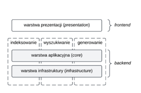

=================================================
Platforma analizy dokumentacji wewnętrznej
=================================================

Dokumentacja dotyczy platformy analizy dokumentacji wewnętrznej – systemu, który umożliwia pobieranie, przetwarzanie i przechowywanie aktów prawnych i dokumentacji wewnętrznej, jak również analizę tych materiałów z wykorzystaniem dużych modeli językowych

Celem aplikacji jest wspieranie prawników oraz innych specjalistów wspierających procesy prawne organizacji w ocenie zgodności prawnej dokumentacji wewnętrznej ze względu na zmiany w prawie powszechnie obowiązującym.

Podstawowy przypadek użycia obsługiwany przez aplikację to:

#. użytkownik wprowadza do systemu pliki PDF dokumentacji wewnętrznej,
#. użytkownik oznacza akty prawne, które chce obserwować,
#. system informuje użytkownika o zmianach w aktach prawnych oraz ocenia, które z tych zmian będą prawdopodobnie implikowały konieczność dokonania zmian w przechowywanych dokumentach organizacyjnych.

Architektura
------------

Architektura systemu jest wdrożona w oparciu o koncepcję generacji wspomaganej wyszukiwaniem (RAG) oraz założenia architektury warstwowej, w konsekwencji zapewniając o modularności, skalowalności i czytelnym rozdzieleniu odpowiedzialności pomiędzy komponentami. Wyodrębnia się warstwę prezentacji, aplikacyjną oraz infrastruktury, przy zachowaniu założenia, że moduły systemu RAG (indeksowania, wyszukiwania i generowania) działają w sposób przekrojowy.

Interfejs użytkownika jest zaimplementowany przy użyciu biblioteki Streamlit. W warstwie aplikacji definiuje się logikę biznesową w postaci serwisów (np. ``ActsService``, ``ActChangeImpactService``, ``ClustersService``), które koordynują procesy między funkcjonalnościami realizowanymi w warstwie infrastruktury. W warstwie infrastruktury wdraża się komponenty, odpowiadające za przetwarzanie danych oraz zapewnienie trwałości – są to więc w szczególności klasy obsługujące API (np. ``ELIApiClient``) oraz repozytoria.

Spis treści
-----------

.. toctree::
   :maxdepth: 2
   :caption: Wprowadzenie

   self

.. toctree::
   :maxdepth: 2
   :caption: Referencja API

   api-reference/src.common
   api-reference/src.core
   api-reference/src.infrastructure
   api-reference/src.presentation